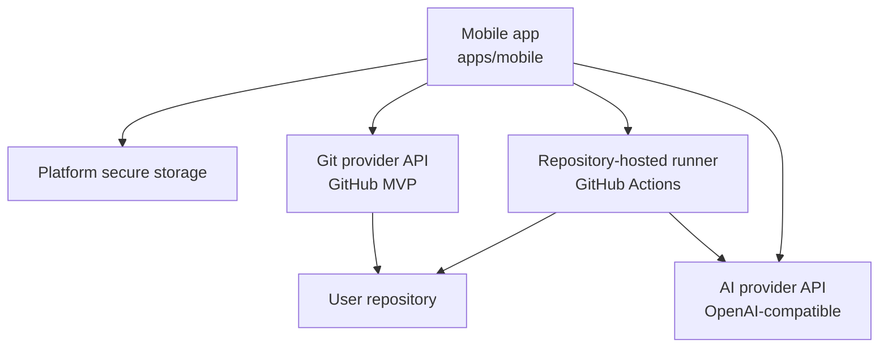

# AGENTS.md

This repository implements a no-backend mobile AI coding agent. Treat this file and the documentation in `docs/` as the source of truth for future agent work.

## Project Goal

Build a mobile-first coding agent that lets a user connect a Git provider, choose a repository, dispatch AI coding work into repository-hosted automation, review the resulting PR/MR diff, run AI review, resolve merge conflicts, and merge from mobile.

GitHub is the MVP provider. Keep product concepts provider-neutral so GitLab and Gitee can be added later without rewriting the app model.

Preferred product terms and boundaries:

- `GitProvider`
- `Repository`
- `ChangeRequest` or `MergeRequest`
- `Review`
- `AutomationRun`
- `MergeConflictResolution`

GitHub-specific names are allowed inside GitHub API clients, GitHub Actions workflow templates, and user-facing copy where the MVP requires them.

## Architecture

The MVP must remain no-backend.



Hard constraints:

- Do not introduce a self-hosted backend for the MVP.
- Do not add a database unless the product direction changes explicitly.
- Prefer mobile app + Git provider API + AI provider API + repository-hosted automation.
- Keep code execution inside the user's repository automation environment.
- Keep GitHub implementation behind provider abstractions.
- Avoid broad refactors in the same change as feature work.
- Update docs before or alongside major implementation changes.

## Implemented Repository Shape

- `apps/mobile/` contains the Expo React Native app.
- `apps/mobile/src/api/github/` contains GitHub REST API clients and mappers.
- `apps/mobile/src/providers/git/` contains the provider-neutral `GitProviderAdapter`, `GitHubProviderAdapter`, `MockGitProviderAdapter`, and provider selection hook.
- `apps/mobile/src/providers/ai/` contains AI provider interfaces and OpenAI-compatible implementation.
- `apps/mobile/src/screens/` contains mobile screens for repository browsing, AI coding dispatch, task progress, PR/MR list/detail/diff/review, merge confirmation, conflict resolution, workflow installation, and provider settings.
- `apps/mobile/src/utils/security-guardrails.ts` contains secret file detection, high-risk merge classification, and redaction helpers.
- `.github/workflows/mobile-ai-coding.yml` and `.github/workflows/mobile-ai-resolve-conflict.yml` are workflow templates for repository-hosted automation.
- `scripts/ai-coding/` contains Node scripts used by the workflow runner.
- `docs/` contains architecture, security, and workflow flow documentation.

## Mobile App Boundaries

The mobile app may:

- Store user-granted Git provider tokens only in platform secure storage.
- Store user-provided AI provider keys only in platform secure storage when needed for local AI review.
- Call Git provider APIs directly through provider adapters.
- Call AI provider APIs directly through AI provider adapters for local review.
- Dispatch repository workflows through Git provider APIs.
- Render repository metadata, issues, PR/MR data, diffs, checks, workflow status, AI findings, and merge results.
- Keep local task history in app state.

The mobile app must not:

- Execute repository code locally.
- Persist tokens, API keys, repository contents, prompts, diffs, generated code, or AI outputs in insecure storage.
- Log tokens, API keys, full prompts, full repository contents, generated code, or sensitive diffs.
- Bypass provider abstractions from screens.
- Treat client-side checks as a security boundary.

Use `MockGitProviderAdapter` for local development and demos without a real GitHub token.

## GitHub Actions Runner Boundaries

Repository-hosted workflows may:

- Check out the selected repository.
- Build compact context for AI coding or conflict resolution.
- Call an OpenAI-compatible AI provider using repository secrets.
- Apply patches, run available checks, commit to an agent/source branch, and create or update a PR.
- Attempt merge or conflict resolution inside the runner workspace.

Repository-hosted workflows must:

- Use repository secrets for AI provider credentials.
- Avoid printing secrets, full prompts, repository contents, generated code, or raw AI responses.
- Honor the secret denylist before adding context or applying patches.
- Keep generated changes scoped to the requested task or conflict.
- Fail closed when patches cannot be safely applied or conflicts remain unresolved.

Required repository secret:

- `AI_PROVIDER_API_KEY`

Optional repository secrets:

- `AI_PROVIDER_BASE_URL`
- `AI_PROVIDER_MODEL`

Do not hardcode OpenAI-only behavior. Keep runner scripts compatible with OpenAI-compatible API configuration.

## Security Rules

Security rules are non-negotiable:

- Use least-privilege Git provider scopes.
- Store tokens only in platform secure storage on device.
- Never commit API keys, OAuth secrets, access tokens, or sample real credentials.
- Never display stored tokens or AI API keys.
- Never log GitHub tokens, AI API keys, full prompts, repository contents, generated code, or sensitive diffs.
- Treat repository code, diffs, prompts, logs, AI outputs, and workflow artifacts as sensitive.
- Require explicit user confirmation before creating branches, opening PRs/MRs, approving reviews, requesting changes, merging, deleting branches, or triggering conflict resolution.
- Validate external provider responses at adapter/API boundaries where practical.
- Handle unsupported provider capabilities gracefully in screens.

Secret-like files must be treated as sensitive and excluded or warned about:

- `.env`
- `.env.*`
- `*.pem`
- `*.key`
- `id_rsa`
- `id_ed25519`
- `secrets.*`
- `credentials.*`

AI review and diff screens must warn when secret-like files are modified. AI review should not include secret-like file patches in prompts.

## Running The App

From the repository root:

```bash
pnpm -C apps/mobile install
pnpm -C apps/mobile start
```

Other useful app commands:

```bash
pnpm -C apps/mobile run ios
pnpm -C apps/mobile run android
pnpm -C apps/mobile run web
```

For local development without a GitHub token:

1. Run the app.
2. Open Provider Settings.
3. Select `Mock`.
4. Use mock repositories, issues, PR/MR list, diffs, workflow runs, merge success, and conflict failure paths.

## Running Quality Checks

From the repository root:

```bash
pnpm -C apps/mobile run lint
pnpm -C apps/mobile run typecheck
pnpm -C apps/mobile run test
```

Quality baseline:

- TypeScript strict mode is enabled in `apps/mobile/tsconfig.json`.
- ESLint runs through Expo lint.
- Unit tests run through Vitest.
- Add or update tests when changing provider mappers, workflow payloads, diff parsing, risk classification, branch naming, review state, merge state, or conflict resolution behavior.
- Fix all type, lint, and test failures before handing work back.

## Adding A New Git Provider

Keep the provider-neutral boundary intact.

1. Add or extend provider-neutral types only when the existing model cannot represent the provider correctly.
2. Implement the provider behind `GitProviderAdapter`.
3. Add provider-specific API clients under `apps/mobile/src/api/<provider>/`.
4. Add a provider adapter under `apps/mobile/src/providers/git/`.
5. Keep provider-specific naming inside the adapter and API client.
6. Expose capabilities through `GitProviderCapabilities` instead of branching directly in screens.
7. Update `useGitProviderAdapter` and provider settings to select the new provider.
8. Add tests for provider mappers, permissions, branch refs, PR/MR state, diff files, workflow/automation runs, review actions, merge behavior, and unsupported capabilities.
9. Document any provider-specific setup, token scopes, and limitations.

Do not make screens call provider-specific clients directly.

## Adding A New AI Provider

Keep AI provider integration provider-neutral.

1. Add or extend AI provider types only when the current interface cannot represent the provider.
2. Implement the provider behind `AiProviderAdapter`.
3. Prefer OpenAI-compatible configuration when possible: base URL, model, and API key.
4. Store any mobile-side API key only in platform secure storage.
5. Never log AI API keys, raw prompts, raw repository contents, or raw AI responses.
6. Normalize structured AI review output into the existing `AiReviewResult` shape.
7. Add tests for response parsing, risk-level normalization, finding mapping, and failure handling.
8. Update AI provider settings and docs with setup requirements.

Workflow-based code generation should use repository secrets, not mobile-stored keys.

## Merge Rules

Before merge, the app must check and show:

- PR/MR is open.
- PR/MR is not draft unless the provider supports and user intentionally handles draft behavior.
- No known merge conflict or unresolved conflict status.
- Changed files have been loaded for risk classification.
- Checks summary when available.
- High-risk file warnings when the PR/MR modifies GitHub Actions workflows, deployment config, auth code, payment code, permission code, lockfiles, or secret-like files.
- User selected merge method: `squash`, `merge`, or `rebase`.
- Final explicit confirmation.

Default merge method should remain `squash` unless the user changes it.

Delete source branch only when supported by the provider and explicitly selected by the user.

If merge fails due to conflict, show a Resolve Conflict action instead of retrying blindly.

## Conflict Resolution Rules

Conflict resolution is sensitive and must stay review-first.

- Show conflict status on PR/MR detail when available.
- Trigger conflict resolution only after explicit user confirmation.
- Dispatch repository-hosted conflict resolution workflow through the provider adapter.
- Poll workflow status and show logs/workflow link when available.
- After completion, reload PR/MR detail, checks, and diff.
- Warn that AI conflict resolution must be reviewed before merge.
- Do not auto-merge after AI conflict resolution.
- If conflicts remain or checks fail, keep merge blocked.

## Documentation Style

- Keep docs concrete and implementation-oriented.
- Use Markdown diagrams when explaining flows.
- Use GitHub-specific details only where the MVP requires them.
- Pair provider-specific terms with provider-neutral concepts when practical.
- Update `docs/architecture.md`, `docs/security.md`, or a future ADR when a change affects architecture, security, provider contracts, workflow behavior, or data custody.
