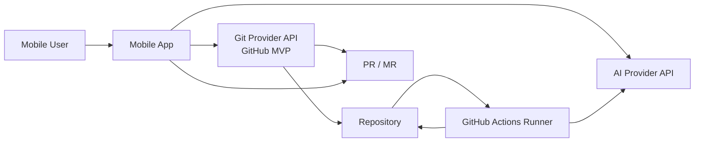

# Mobile AI Coding Agent

A no-backend mobile app for creating, modifying, reviewing, and merging code through Git provider APIs, AI provider APIs, and hosted repository automation. The MVP targets GitHub first while keeping internal concepts provider-neutral enough to support Gitee and GitLab later.

## MVP Scope

The app lets a user:

- Connect a GitHub account.
- Create a new repository.
- Select an existing repository.
- Ask an AI coding agent to generate or modify code.
- Submit generated code to a pull request.
- Review pull request diffs on mobile.
- Approve or request changes.
- Merge pull requests from mobile.
- Resolve merge conflicts through GitHub Actions.

The MVP intentionally has no self-hosted backend. All orchestration happens between the mobile app, GitHub APIs, the selected AI provider API, and GitHub Actions running inside the user's repository.

## System Overview

## Core Concepts

Use provider-neutral names in app code and documentation, even when the first implementation calls GitHub-specific APIs.

| Neutral term | GitHub MVP | Future providers |
| --- | --- | --- |
| Git provider | GitHub | Gitee, GitLab |
| Repository | Repository | Repository |
| Change request | Pull request | Merge request |
| Automation runner | GitHub Actions | Gitee Go, GitLab CI |
| Review decision | Approve / request changes | Approve / request changes |
| Merge operation | Merge PR | Merge PR/MR |

## Documentation

- [Architecture](docs/architecture.md)
- [Product Requirements](docs/product-requirements.md)
- [Security](docs/security.md)
- [GitHub Actions Flow](docs/github-actions-flow.md)
- [Agent Instructions](AGENTS.md)

## Current Status

This repository currently contains initial product and architecture documentation only. App implementation, workflow templates, and provider integrations are intentionally out of scope for this initial pass.

## Non-Goals for MVP

- No self-hosted API backend.
- No hosted database controlled by this product.
- No long-lived server-side job queue.
- No self-hosted code execution runner.
- No provider other than GitHub in the first implementation.

## Development Notes

Before adding app code, confirm:

- Mobile framework and target platforms.
- OAuth strategy and supported account types.
- AI provider selection and key handling model.
- Initial GitHub Actions workflow contract.
- Minimum repository permissions required by each feature.

