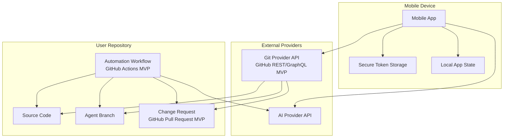
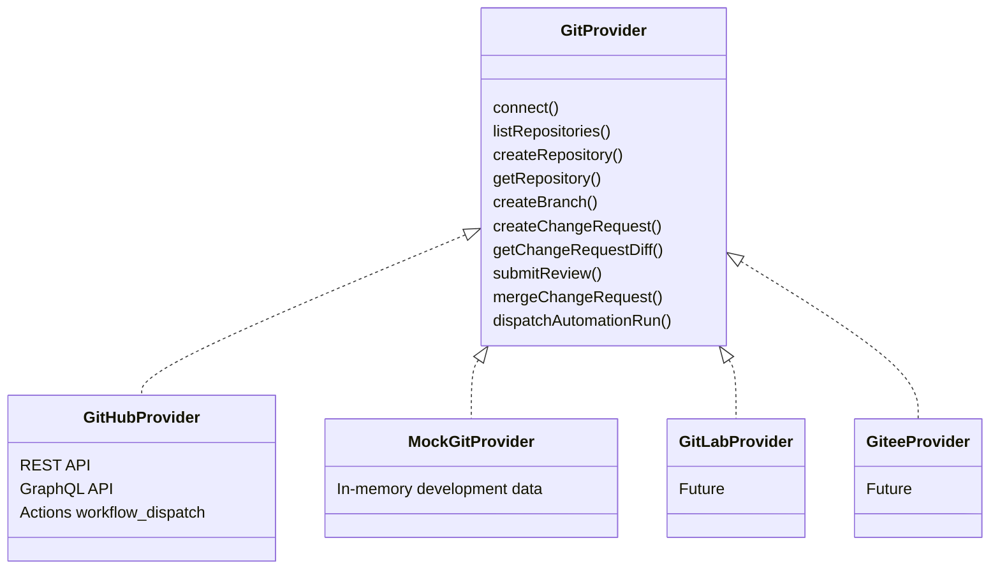
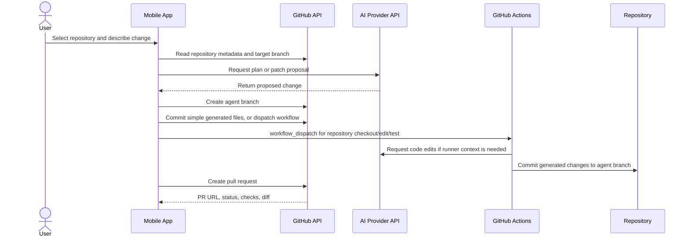
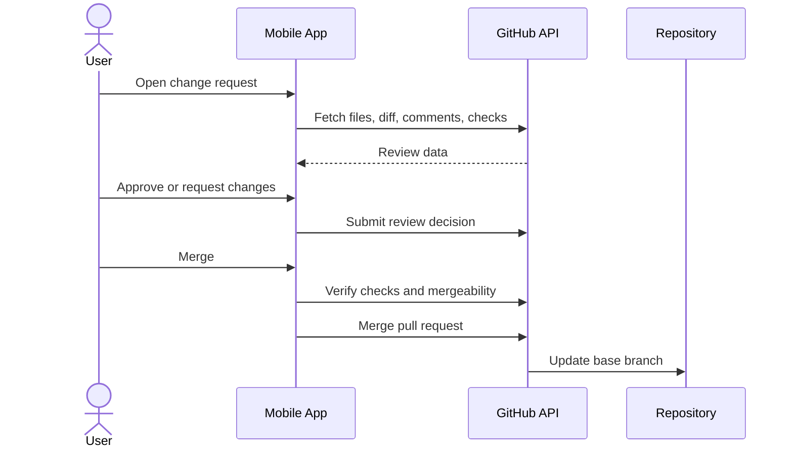
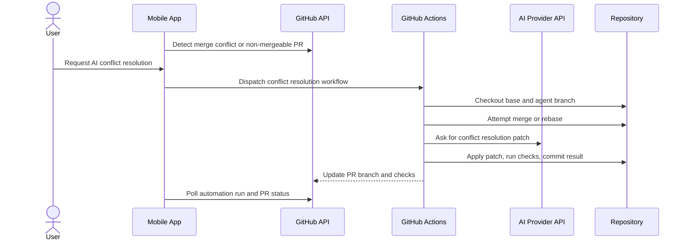

# Architecture

## Summary

The MVP is a no-backend mobile AI coding agent. The mobile app directly coordinates with GitHub APIs, an AI provider API, and GitHub Actions workflows installed in or dispatched against the selected repository.

GitHub is the first supported Git provider, but the domain model should avoid GitHub-only names where a neutral name works. The main abstraction is a `GitProvider` with repositories, change requests, reviews, merge operations, and automation runs.

## Goals

- Let users create and modify code from a mobile device.
- Keep execution inside trusted repository automation, not a product-owned backend.
- Support PR review and merge workflows from mobile.
- Resolve merge conflicts through GitHub Actions.
- Preserve a path to Gitee and GitLab by keeping provider-specific behavior isolated.

## Non-Goals

- Running arbitrary code on product-owned infrastructure.
- Storing user repositories on product-owned servers.
- Maintaining a product backend, job queue, or database in the MVP.
- Supporting GitLab or Gitee in the first release.

## Logical Architecture

## Main Components

| Component | Responsibility |
| --- | --- |
| Mobile App | User experience, authentication, repository browsing, prompt capture, AI request orchestration, review UI, merge UI |
| Secure Token Storage | Stores user-granted Git provider tokens and user-provided AI provider credentials when required |
| Git Provider Adapter | Provider-neutral interface over repositories, branches, diffs, change requests, reviews, merges, and workflow dispatch |
| GitHub Adapter | MVP implementation of the Git provider adapter using GitHub APIs |
| Mock Git Adapter | Local development implementation with in-memory repositories, issues, PR/MR data, diffs, workflow runs, merge success, and conflict failure paths |
| AI Provider Adapter | Provider-neutral interface over code generation and code modification requests |
| GitHub Actions Workflow | Repository-hosted execution runner for edits that need checkout, tests, commits, or conflict resolution |

## Provider Abstraction

## Code Generation Flow

## Review and Merge Flow

## Conflict Resolution Flow

## Data Boundaries

| Data | Location | Notes |
| --- | --- | --- |
| Git provider access token | Mobile secure storage | Minimum scopes, revocable by user |
| AI provider key | Mobile secure storage or repository secret | Depends on selected provider and workflow mode |
| Repository contents | Git provider and runner workspace | Not stored by product backend |
| Prompts and AI outputs | Mobile local state and runner logs | Must be minimized and redacted |
| PR/MR review data | Git provider | Fetched on demand by mobile app |

## Key Design Decisions

- The MVP avoids a product backend to reduce operational scope and data custody.
- GitHub Actions is the execution runner for tasks that require a working tree, tests, commits, or conflict resolution.
- Mobile app calls GitHub directly for repository and review operations.
- The Mock Git adapter is a developer-only local data source so all main screens can be exercised without a real GitHub token.
- Provider-specific terms stay near adapter implementations; product screens and domain models use neutral naming where possible.
