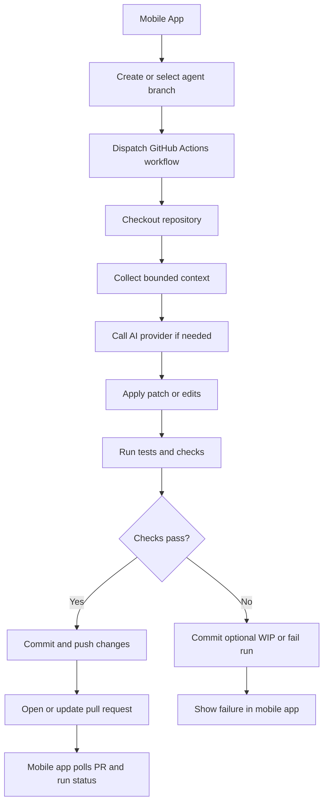
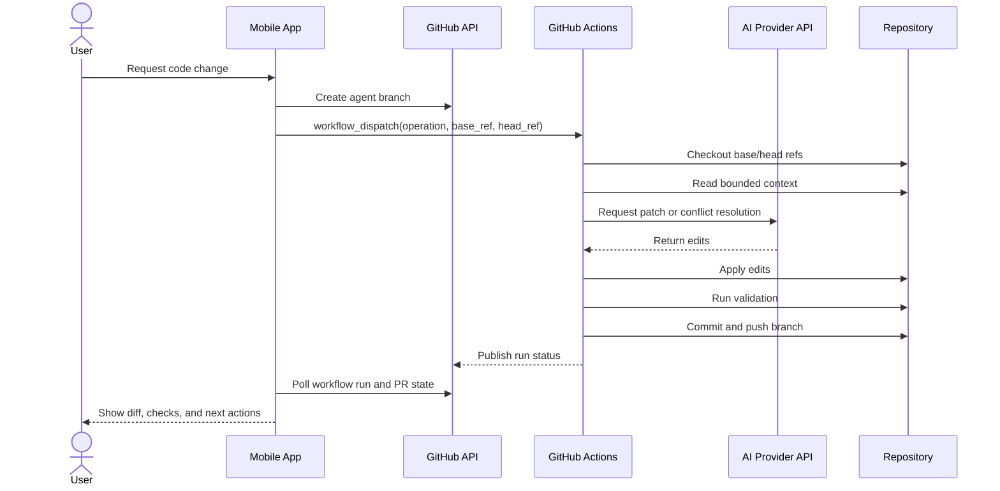
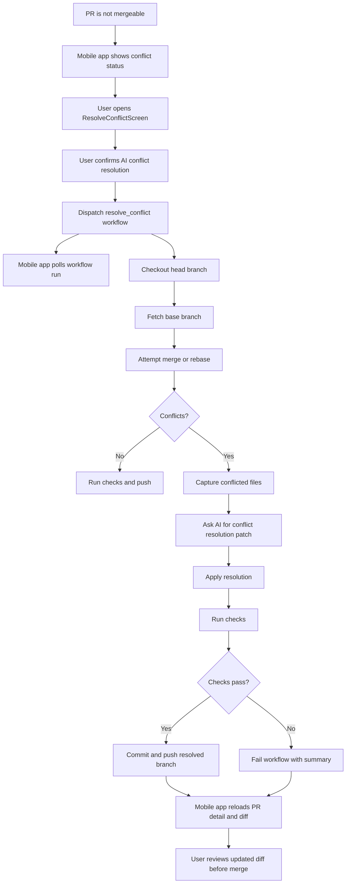
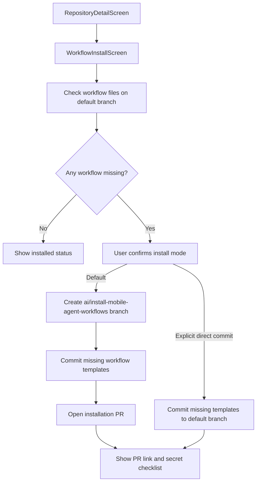
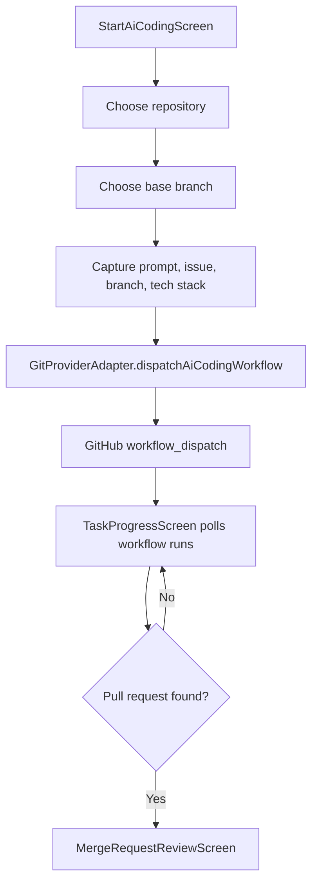

# GitHub Actions Flow

## Purpose

GitHub Actions is the MVP execution runner. It handles tasks that require a checked-out working tree, test execution, commits, or merge conflict resolution. The product does not operate a backend runner.

Internally, this should be modeled as an `AutomationRun` owned by a `GitProvider`. For GitHub, the implementation uses Actions workflow dispatch and workflow run polling.

## Runner Responsibilities

- Check out the selected repository and branch.
- Apply AI-generated code edits when runner context is required.
- Run configured validation commands.
- Commit generated changes to an agent branch.
- Attempt merge conflict resolution.
- Push updates back to the pull request branch.
- Report status through GitHub checks and workflow logs.

## High-Level Flow



## Workflow Dispatch Contract

The mobile app should dispatch a fixed workflow with validated inputs. Do not pass arbitrary shell commands from the app to the runner.

Suggested inputs:

| Input | Description |
| --- | --- |
| `operation` | `generate`, `modify`, or `resolve_conflict` |
| `repository` | Provider repository identifier |
| `base_ref` | Base branch or SHA |
| `head_ref` | Agent branch |
| `change_request_id` | Pull request number for updates or conflict resolution |
| `prompt_ref` | Reference to prompt payload location, if needed |
| `ai_provider` | Selected AI provider identifier |
| `validation_profile` | Named validation profile from repository config |

Avoid placing large prompts or source code directly in workflow inputs because inputs may be visible in logs or run metadata.

## Sequence



## Conflict Resolution Flow



## Repository Workflow Shape

The MVP workflow templates live in:

- `.github/workflows/mobile-ai-coding.yml`
- `.github/workflows/mobile-ai-resolve-conflict.yml`

The runner scripts live in `scripts/ai-coding/`. They use an OpenAI-compatible chat completions API through repository secrets, not a product-owned backend.

Expected workflow traits:

- Triggered by `workflow_dispatch`.
- Explicit `permissions`.
- Supports named operations instead of arbitrary commands.
- Uses repository secrets for AI provider credentials when runner-side AI calls are enabled.
- Writes only to the selected agent branch.
- Produces concise summaries for mobile display.
- Redacts tokens and sensitive prompt content.

Required repository secret:

| Secret | Purpose |
| --- | --- |
| `AI_PROVIDER_API_KEY` | API key for the selected OpenAI-compatible AI provider. |

Optional repository secrets:

| Secret | Purpose |
| --- | --- |
| `AI_PROVIDER_BASE_URL` | Provider base URL. Defaults to the script's OpenAI-compatible endpoint fallback when omitted. |
| `AI_PROVIDER_MODEL` | Provider model name. Defaults to the script fallback model when omitted. |

Example permission intent:

```yaml
permissions:
  contents: write
  pull-requests: write
  checks: read
```

The final permissions may need adjustment based on the GitHub authentication model and branch protection requirements.

## Workflow Installation From Mobile

The app can install the workflow templates into a selected GitHub repository from
`WorkflowInstallScreen`.



Required behavior:

- Check `.github/workflows/mobile-ai-coding.yml`.
- Check `.github/workflows/mobile-ai-resolve-conflict.yml`.
- Default to creating `ai/install-mobile-agent-workflows` and opening a pull request.
- Only write directly to the default branch after the user explicitly selects direct commit and confirms.
- Show required and optional repository secrets before installation:
  - `AI_PROVIDER_API_KEY` required.
  - `AI_PROVIDER_BASE_URL` optional.
  - `AI_PROVIDER_MODEL` optional.

## Mobile App Responsibilities

- Validate user intent before dispatching a workflow.
- Provide only known operation names and validated refs.
- Poll workflow run status.
- Link workflow failures to human-readable mobile states.
- Fetch the updated diff after runner completion.
- Require review before merge after conflict resolution.
- Show `ConflictStatusCard` on pull request detail when conflict status is available.
- Use `ResolveConflictScreen` to dispatch `mobile-ai-resolve-conflict.yml`, poll the run, and refresh PR detail and diff caches.
- Use `WorkflowInstallScreen` to install missing workflow templates through a pull request by default.

## Mobile Dispatch Implementation

The mobile app starts runner-mode coding tasks from `StartAiCodingScreen` and tracks
them in `TaskProgressScreen`.



Local task history is stored in the app task store with repository, base branch,
agent branch, workflow run, and pull request metadata. GitHub-specific workflow
inputs remain behind `GitProviderAdapter`.

## Failure States

| Failure | Mobile handling |
| --- | --- |
| Workflow missing | Offer setup guidance for repository automation |
| Workflow dispatch denied | Explain missing permissions |
| AI provider error | Show provider error category and retry option |
| Patch apply failed | Show affected files and workflow summary |
| Validation failed | Show failing command summary and logs link |
| Push rejected | Refresh branch state and offer retry |
| Conflict unresolved | Keep PR blocked and show manual review path |

## Future Provider Mapping

| Neutral concept | GitHub MVP | GitLab future | Gitee future |
| --- | --- | --- | --- |
| Automation runner | GitHub Actions | GitLab CI | Gitee Go |
| Change request | Pull request | Merge request | Pull request |
| Run dispatch | `workflow_dispatch` | Pipeline trigger | Workflow trigger |
| Run status | Workflow run/checks | Pipeline/job status | Workflow status |
