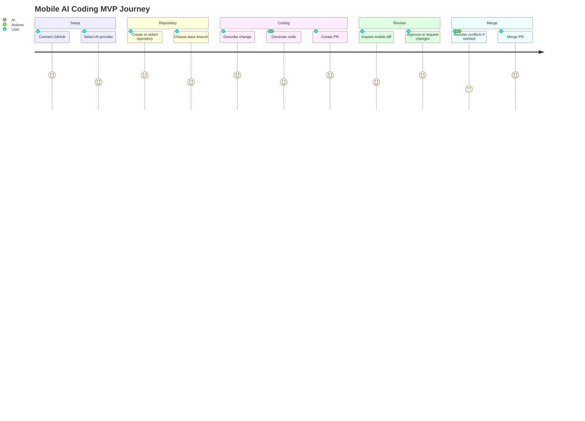

# Product Requirements

## Product Summary

The product is a mobile app that lets developers use an AI coding agent from their phone. Users can connect GitHub, choose or create a repository, ask AI to generate or modify code, submit changes to a pull request, review diffs, approve or request changes, merge, and use GitHub Actions to resolve merge conflicts.

## MVP Objective

Prove that useful code changes can be requested, reviewed, and merged from mobile without a self-hosted backend.

## Target Users

- Developers who need to make small code changes away from a desktop.
- Maintainers who review and merge straightforward pull requests on mobile.
- Technical founders or indie developers who want a lightweight AI coding loop from a phone.

## Core User Stories

| ID | User story | Priority |
| --- | --- | --- |
| PRD-001 | As a user, I can connect my GitHub account. | Must |
| PRD-002 | As a user, I can create a new repository. | Must |
| PRD-003 | As a user, I can select an existing repository. | Must |
| PRD-004 | As a user, I can describe a code change in natural language. | Must |
| PRD-005 | As a user, I can ask AI to generate or modify code. | Must |
| PRD-006 | As a user, I can create a pull request with generated changes. | Must |
| PRD-007 | As a user, I can review a pull request diff on mobile. | Must |
| PRD-008 | As a user, I can approve or request changes on a pull request. | Must |
| PRD-009 | As a user, I can merge a pull request from mobile. | Must |
| PRD-010 | As a user, I can trigger GitHub Actions to resolve merge conflicts. | Must |
| PRD-011 | As a user, I can see workflow status and failure logs. | Should |
| PRD-012 | As a user, I can choose an AI provider. | Should |
| PRD-013 | As a user, I can connect future Git providers such as GitLab or Gitee. | Later |

## Functional Requirements

### Authentication and Provider Connection

- Support GitHub account connection for the MVP.
- Request only scopes needed for selected features.
- Store access tokens in platform secure storage.
- Let users disconnect a Git provider account.
- Use internal naming that supports `GitProvider`, not only GitHub.

### Repository Management

- List repositories visible to the connected account.
- Search or filter repositories.
- Create a new GitHub repository with name, visibility, description, and optional initialization choices.
- Select a repository as the active workspace.
- Fetch repository default branch and permission level.

### AI Coding Requests

- Capture natural-language change requests.
- Include selected repository context within strict size and privacy limits.
- Support two execution modes:
  - Direct API mode for simple file creation or edits through the Git provider API.
  - Runner mode for checkout, tests, multi-file edits, dependency-aware changes, and conflict resolution.
- Show generated plan or summary before creating a change request when practical.

### Workflow Installation

- Check whether the selected GitHub repository has `.github/workflows/mobile-ai-coding.yml`.
- Check whether the selected GitHub repository has `.github/workflows/mobile-ai-resolve-conflict.yml`.
- If either workflow is missing, let the user install the missing workflow templates.
- Default installation must create `ai/install-mobile-agent-workflows`, commit the workflow files, and open a pull request.
- Do not commit workflow files directly to the default branch unless the user explicitly selects direct commit and confirms.
- Show the required repository secret `AI_PROVIDER_API_KEY`.
- Show optional repository secrets `AI_PROVIDER_BASE_URL` and `AI_PROVIDER_MODEL`.

### Change Request Creation

- Create an agent branch from the selected base branch.
- Commit generated changes to the agent branch.
- Open a GitHub pull request.
- Use provider-neutral internal name `ChangeRequest`.
- Track title, description, base branch, head branch, status, checks, and diff summary.

### Mobile Diff Review

- List open change requests for the selected repository.
- Show title, number, author, source branch, target branch, and status.
- Show a detail page with body, branch refs, file summary, mergeability, checks, and review/merge actions.
- Display changed files grouped by status.
- Collapse changed files by default on mobile and expand one file at a time for review.
- Support inline diff viewing optimized for small screens.
- Render unified diff patches with native mobile components in the first version.
- Show additions, deletions, renamed files, binary file indicators, and large diff fallbacks.
- Show check status and mergeability.
- Allow approve and request-changes decisions where the user has permission.
- Support AI review of compact diff context with structured summary, risk, findings, and recommendation.
- Let users choose AI findings to submit as general pull request comments in the MVP; provider-specific inline comment mapping can be added later.
- Support GitHub approval reviews, request-changes reviews with a message, and general pull request comments through provider adapter methods.

### Merge

- Validate that the user has merge permission.
- Show check status before merge.
- Support the repository's allowed merge methods where available.
- Let the user choose squash, merge, or rebase, defaulting to squash.
- Let the user delete the source branch after merge when the provider supports it and the source branch belongs to the selected repository.
- Require explicit confirmation before merging.
- Surface merge failures with actionable messages.
- If merge fails because of a conflict, offer the conflict resolution workflow.

### Conflict Resolution

- Detect non-mergeable pull requests.
- Show conflict status on the change request detail screen when the provider exposes it.
- Let the user trigger an automation run to resolve conflicts.
- Dispatch a GitHub Actions workflow with repository, pull request, base, and head context.
- Poll the conflict resolution workflow run from the mobile app and link to the latest logs when available.
- Apply AI-generated conflict resolution in the runner.
- Commit conflict resolution changes back to the pull request branch.
- Reload change request detail and diff data after the workflow completes.
- Warn that AI conflict resolution must be reviewed before merge.

## Non-Functional Requirements

| Category | Requirement |
| --- | --- |
| Privacy | Do not send repository context to AI providers without user intent and clear controls. |
| Security | Avoid product-owned storage of source code, tokens, prompts, and generated code. |
| Reliability | Recover gracefully from API rate limits, network loss, workflow failures, and merge conflicts. |
| Performance | Keep mobile screens responsive when loading large diffs or repository lists. |
| Extensibility | Keep provider-specific APIs behind adapter interfaces. |
| Auditability | Preserve changes, reviews, and merges in the Git provider's native audit trail. |

## MVP User Journey

## Success Metrics

- Time from prompt to opened pull request.
- Percentage of AI-generated pull requests with passing checks.
- Percentage of pull requests reviewed on mobile.
- Merge success rate after mobile review.
- Conflict resolution workflow success rate.
- User-perceived confidence in mobile diff review.

## Out of Scope

- Desktop app.
- Self-hosted backend.
- Team administration.
- Billing.
- Enterprise SSO.
- GitLab and Gitee implementation.
- Long-running background agents outside GitHub Actions.
