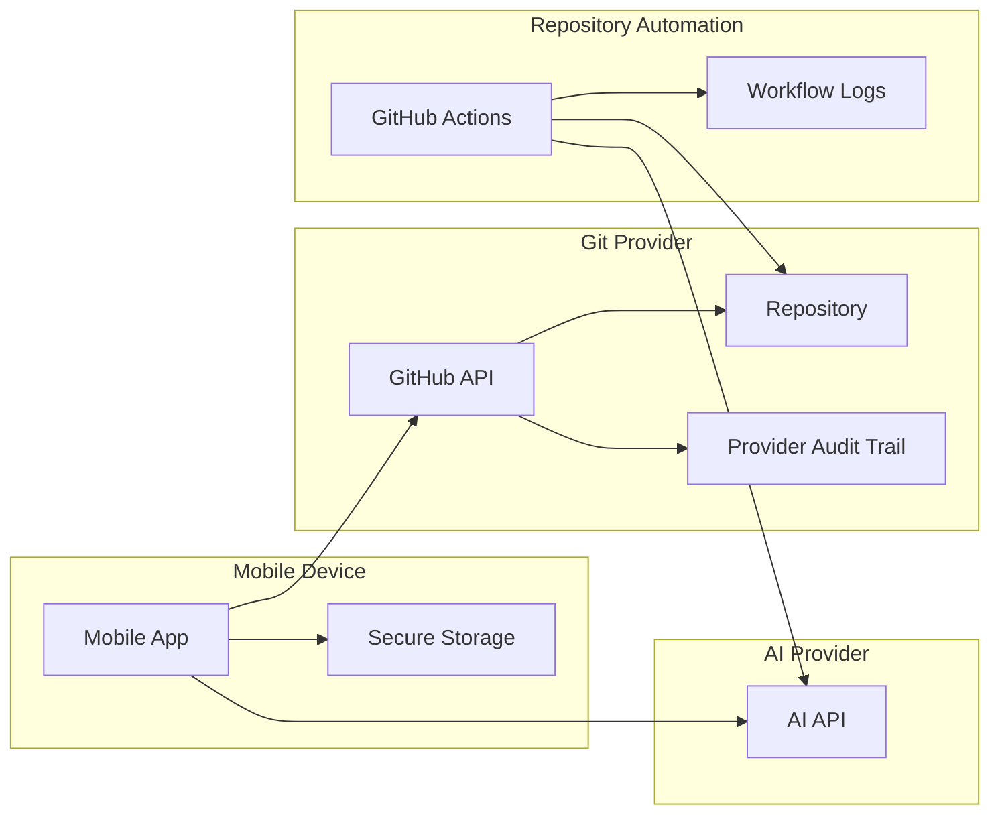

# Security

## Security Posture

The MVP reduces product-operated risk by avoiding a self-hosted backend. That does not remove security responsibility. The mobile app still handles sensitive tokens, repository metadata, source code snippets, prompts, AI outputs, review actions, and merge actions.

The security model is based on least privilege, explicit user intent, local secure storage, provider-native audit trails, and repository-hosted execution.

## Trust Boundaries

## Sensitive Data

| Data | Risk | MVP handling |
| --- | --- | --- |
| Git provider token | Repository takeover if leaked | Store in platform secure storage, request least privilege, allow revoke/disconnect |
| AI provider key | Cost abuse and data access | Prefer secure storage or repository secrets, never log, allow rotation |
| Repository contents | Source exposure | Fetch only required context, avoid product backend storage |
| Prompts | May include secrets or private plans | Redact where possible, warn users, minimize retention |
| AI outputs | May contain generated secrets or vulnerable code | Require review, scan when possible, preserve diff trail |
| Workflow logs | May expose prompts, commands, or files | Redact tokens and avoid printing full prompt/code context |
| Review and merge actions | Unauthorized changes | Check permissions and require explicit confirmation |

## Authentication and Authorization

- Use GitHub OAuth or GitHub App authentication for the MVP; choose the final approach before implementation.
- Request only required permissions for repository listing, repository creation, contents, pull requests, reviews, workflow dispatch, and merge operations.
- Respect repository permission levels in the UI.
- Disable approve, request-changes, merge, and workflow dispatch actions when the provider indicates insufficient permissions.
- Do not rely on hidden UI controls as authorization. Always check provider responses.

## Token Storage

- Store mobile tokens in iOS Keychain or Android Keystore-backed secure storage.
- Never display stored Git provider tokens or AI provider API keys after saving them.
- Never store access tokens in plain local storage, logs, analytics, crash reports, screenshots, or clipboard by default.
- Never log GitHub tokens, AI API keys, or full Authorization headers.
- Support disconnecting a Git provider account.
- Support AI key removal and rotation.
- Prefer short-lived tokens where provider support allows.

## AI Provider Data Controls

- Show users when repository content will be sent to an AI provider.
- Send the smallest useful repository context.
- Avoid sending full repository archives in the MVP.
- Do not include secrets from `.env`, credentials files, build artifacts, or dependency caches.
- Maintain a secret denylist for repository context, AI review, patch application, conflict resolution, and mobile warnings:
  - `.env`
  - `.env.*`
  - `*.pem`
  - `*.key`
  - `id_rsa`
  - `id_ed25519`
  - `secrets.*`
  - `credentials.*`
- Warn in diff and AI review screens when secret-like files are modified.
- Omit secret-like file patches from mobile AI review requests.
- Treat AI output as untrusted code until reviewed and tested.

## Runner Security

GitHub Actions runs in the user's repository context, so workflow permissions must be narrow.

- Set workflow `permissions` explicitly.
- Prefer branch-scoped writes to agent branches.
- Avoid exposing broad secrets to pull requests from untrusted forks.
- Avoid logging tokens, prompts, patches, and file contents.
- Pin third-party actions by commit SHA for production workflows.
- Keep generated workflow inputs validated and minimal.
- Do not run arbitrary shell supplied directly by the mobile app.

## Merge and Review Safety

- Require explicit confirmation before submitting a review decision.
- Require a final confirmation before merging.
- Show checks, required reviews, branch protection status, and mergeability where available.
- Run a pre-merge changed-file scan and warn when the PR modifies GitHub Actions workflows, deployment config, auth code, payment code, permission code, lockfiles, or secret-like files.
- Preserve all review and merge actions in the Git provider audit trail.
- Treat conflict resolution as a new code change that must be reviewed before merge.

## Threat Model

| Threat | Example | Mitigation |
| --- | --- | --- |
| Token theft | Device compromise or accidental logging | Secure storage, redaction, short-lived tokens, disconnect |
| Excessive permissions | App requests broad repo access | Least-privilege scopes, clear permission explanations |
| Prompt injection from repository content | Malicious file asks AI to reveal secrets | Context filtering, instruction hierarchy, never include secrets |
| Malicious generated code | AI introduces vulnerable code | Diff review, checks, tests, optional scanning |
| Workflow abuse | Mobile input causes dangerous runner commands | Fixed workflow contract, validated inputs, no arbitrary command execution |
| Secret exfiltration in logs | Workflow prints env vars or prompts | Mask secrets, avoid verbose logs, review workflow templates |
| Unauthorized merge | User taps merge without understanding state | Permission checks, status display, confirmation |
| Supply chain compromise | Third-party GitHub Action changes behavior | Pin actions, minimize dependencies |

## MVP Security Checklist

- Define GitHub authentication model.
- Define exact GitHub scopes or GitHub App permissions.
- Define AI provider key storage model.
- Create repository-context filtering rules.
- Define workflow input schema.
- Define workflow permissions.
- Add log redaction rules.
- Add confirmation UI for review, merge, and conflict resolution.
- Add changed-file warnings for secret-like and high-risk paths.
- Add documentation for disconnecting accounts and revoking tokens.
